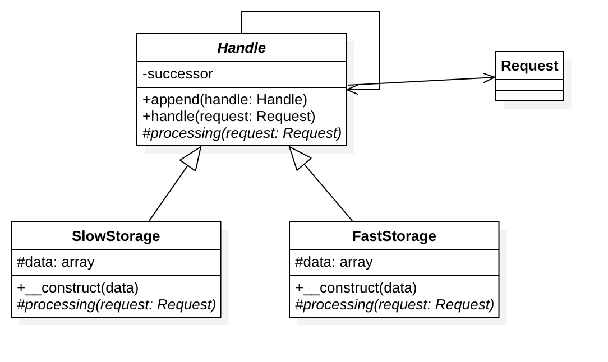

# 责任链模式

## 目的
建立一个对象链来按指定顺序处理调用，如果其中一个对象无法处理命令，它会委托这个调用给他的下一个对象来进行处理，以此类推。

## 优点
1. 当客户提交一个请求时，请求是沿链传递直至有一个ConcreteHandle对象负责处理他。
2. 接收者和发送者都没有对方的明确信息，且链中的对象自己也不知道链的结构。
结果是职责链可简化对象的相互连接，它们仅需保持一个指向其后继者的引用，而不需保持它所有的候选接受者的引用。
3. 随时地增加或修改处理一个请求的结构。增强了给对象指派职责的灵活性。

## 注意
1. 一个请求极有可能到了链的末端都得不到处理，或者因为没有正确配置而得不到处理。

## 例子
1. 日志框架，每个链元素自主决定如何处理日志。
2. 垃圾邮件过滤器。
3. 缓存：例如第一个对象是一个 Memcached 接口实例，如果 “丢失” 它会委托数据库接口处理这个调用。
4. Yii 框架: CFilterChain 是一个控制器行为过滤器链。执行点会有链上的过滤器逐个传递，
并且只有当所有的过滤器验证通过，这个行为最后才会被调用。

## UML类图

