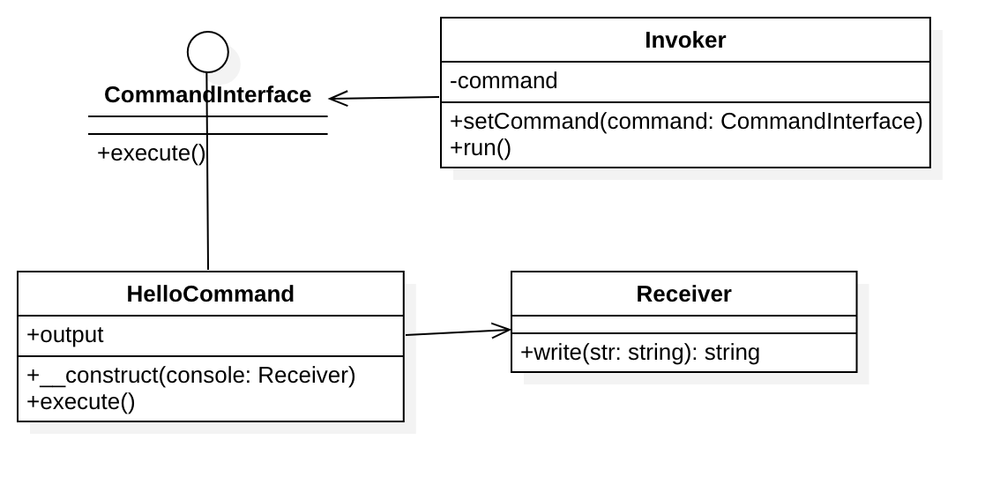

# 命令模式

## 定义
命令模式（Command）将请求封装成对象，从而使你可用不同的请求对客户进行参数化；对请求排队或记录请求日志，以及支持可撤消的操作。

## 例子
1. 假设我们有一个调用者类 Invoker 和一个接收调用请求的类 Receiver，
在两者之间我们使用命令类 Command 的 execute 方法来托管请求调用方法，
这样，调用者 Invoker 只知道调用命令类的 execute 方法来处理客户端请求，
从而实现接收者 Receiver 与调用者 Invoker 的解耦。

2. Laravel 中的 Artisan 命令就使用了命令模式。

## 角色
1. 命令(Command)角色：声明了一个给所有具体命令类的抽象接口。
2. 具体命令(ConcreteCommand)角色：定义一个接收者和行为之间的弱耦合；实现execute()方法，负责调用接收者的相应操作。execute()方法通常叫做执行方法。
3. 请求者(Invoker)角色：负责调用命令对象执行请求，相关的方法叫做行动方法。
4. 接收者(Receiver)角色：负责具体实施和执行一个请求。任何一个类都可以成为接收者，实施和执行请求的方法叫做行动方法。

## UML类图

