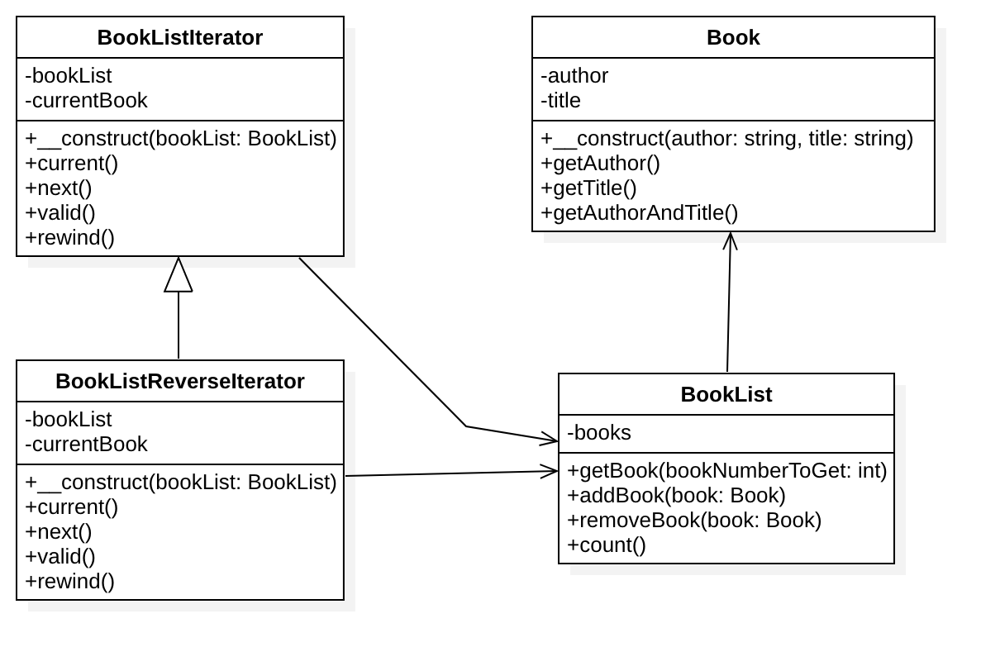

# 迭代器模式

## 目的
让对象变得可迭代并表现得像对象集合。

## 角色
1. 迭代器角色（Iterator）: 迭代器角色负责定义访问和遍历元素的接口。
2. 具体迭代器角色（Concrete Iterator）: 具体迭代器角色要实现迭代器接口，并要记录遍历中的当前位置。
3. 容器角色（Container）: 容器角色负责提供创建具体迭代器角色的接口。
4. 具体容器角色（Concrete Container）: 具体容器角色实现创建具体迭代器角色的接口——这个具体迭代器角色于该容器的结构相关。

## UML类图

