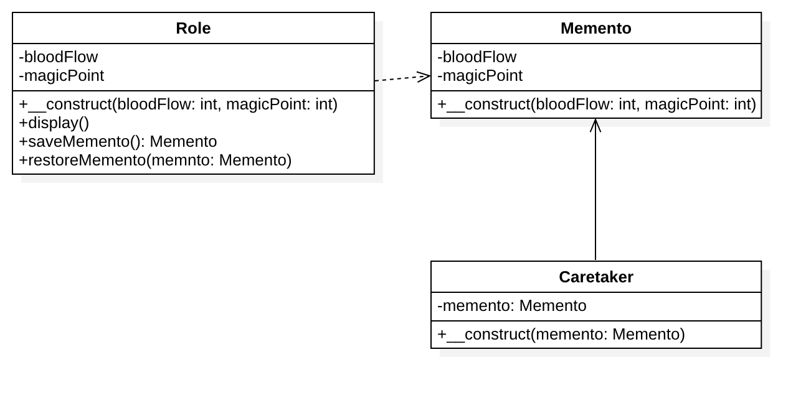

# 备忘录模式

## 简介
备忘录模式是一种给我们的软件提供后悔药的机制，通过它可以使系统恢复到某一特定的历史状态。

## 模式定义
所谓备忘录模式就是在不破坏封装的前提下，捕获一个对象的内部状态，并在该对象之外保存这个状态，这样可以在以后将对象恢复到原先保存的状态。

备忘录模式将要保存的细节给封装在备忘录中，就是那天要改变保存的细节也不会影响到客户端。

## 包含角色
Originator: 原发器。
Memento: 备忘录。
Caretaker: 负责人。

## 备忘录访问控制
对原发器：可以访问备忘录里的所有信息。

对负责人：不可以访问备忘录里面的数据，但是他可以保存备忘录并且可以将备忘录传递给其他对象。

其他对象：不可访问也不可以保存，它只负责接收从负责人那里传递过来的备忘录同时恢复原发器的状态。

## 优缺点
### 优点
1. 给用户提供了一种可以恢复状态的机制。可以是用户能够比较方便地回到某个历史的状态。
2. 实现了信息的封装。使得用户不需要关心状态的保存细节。

### 缺点
消耗资源。如果类的成员变量过多，势必会占用比较大的资源，而且每一次保存都会消耗一定的内存。
      
## UML类图

