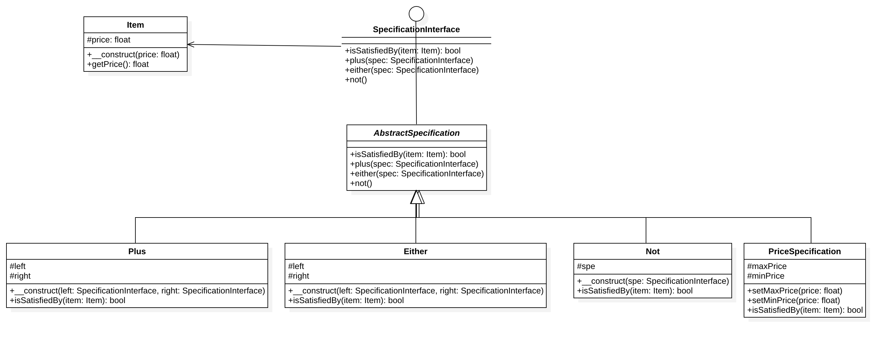

# 规格模式

## 定义
可以认为是组合模式的一种扩展。在框架性开发中使用较多（项目级开发很少使用）。

有时项目中某些条件决定了业务逻辑，这些条件就可以抽离出来以某种关系（与、或、非）进行组合，从而灵活地对业务逻辑进行定制。
另外，在查询、过滤等应用场合中，通过预定义多个条件，然后使用这些条件的组合来处理查询或过滤，
而不是使用逻辑判断语句来处理，可以简化整个实现逻辑。

这里的每个条件就是一个规格，多个规格/条件通过串联的方式以某种逻辑关系形成一个组合式的规格。

## UML类图

