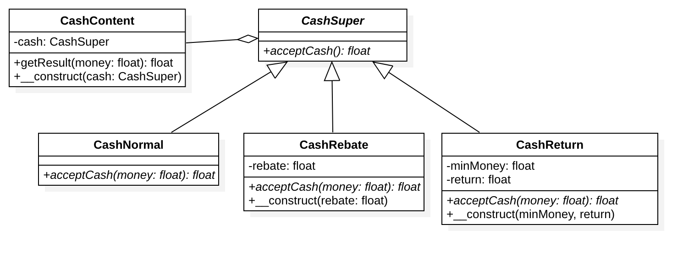

# 策略模式

## 总结
策略模式是一种定义一系列算法的方法，从概念上来看，所有这些算法完成的都是相同的工作，只是实现不同，
它可以以相同的方式调用所有的算法，减少了各种算法类与使用算法类之间的耦合。

策略模式的Strategy类层次为Context定义了一系列的可供重用的算法或行为。
继承有助于析取出这些算法中公共功能。

策略模式简化了单元测试，因为每个算法都有自己的类，可以通自己接口单独测试。

当不同的行为堆砌在一个类中时，就很难避免使用条件语句来选择合适的行为。
将这些行为封装在一个个Strategy类中，可以在使用这些行为的类中消除条件语句。

策略模式就是用来封装算法的，但在实践中，我们发现可以用它来封装几乎任何类型的规则，只要在分析过程中听到需要在不同时间应用不同的业务规则，就可以考虑使用策略模式处理这种变化的可能性。

在基本的策略模式中，选择所用具体实现的职责由客户端对象承担，并转给策略模式的Context对象。

## 优点
策略模式封装了变化

## UML类图

