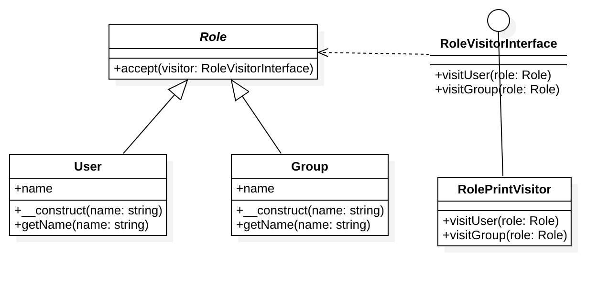

# 访问者模式

## 定义
表示一个作用于某对象结构中的各元素的操作。
它使你可以在不改变各元素的类的前提下定义作用于这些元素的新操作。

## 总结
1. 访问者模式适用于数据结构相对稳定的系统，它把数据结构和作用于结构之上的操作之间的耦合解脱开，使得操作集合可以相对自由的演化。在本例中，User、Group 是数据结构，而 RolePrintVisitor 是访问者（用于结构之上的操作）。
2. 当实现访问者模式时，要将尽可能多的将对象浏览逻辑放在 Visitor 类中，而不是放在它的子类中，这样的话，ConcreteVisitor 类所访问的对象结构依赖较少，从而使维护较为容易。

## UML类图

