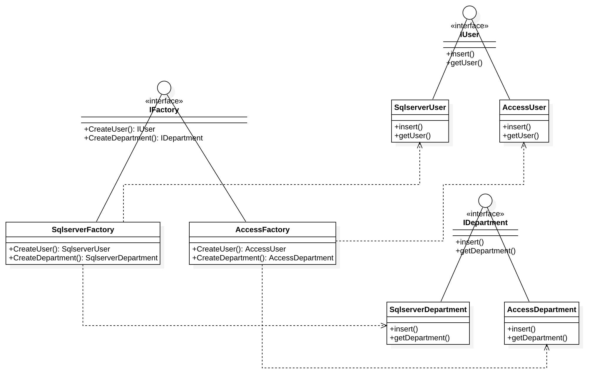

# 抽象工厂模式

## 用法
提供一个创建一系列相关或互相依赖对象的接口，而无需指定他们具体的类。

## 模式动机
产品族

## 优点
- 抽象工厂模式隔离了具体类的生成，使得客户并不需要知道什么被创建。
由于这种隔离，更换一个具体工厂就变得相对容易。
所有的具体工厂都实现了抽象工厂中定义的那些公共接口，因此只需改变具体工厂的实例，就可以在某种程度上改变整个软件系统的行为。
另外，应用抽象工厂模式可以实现高内聚低耦合的设计目的，因此抽象工厂模式得到了广泛的应用。
- 当一个产品族中的多个对象被设计成一起工作时，它能够保证客户端始终只使用同一个产品族中的对象。
这对一些需要根据当前环境来决定其行为的软件系统来说，是一种非常实用的设计模式。
- 增加新的具体工厂和产品族很方便，无须修改已有系统，符合“开闭原则”。

## 缺点
- 在添加新的产品对象时，难以扩展抽象工厂来生产新种类的产品，这是因为在抽象工厂角色中规定了所有可能被创建的产品集合，
要支持新种类的产品就意味着要对该接口进行扩展，而这将涉及到对抽象工厂角色及其所有子类的修改，显然会带来较大的不便。
- 开闭原则的倾斜性（增加新的工厂和产品族容易，增加新的产品等级结构麻烦）。

## 工厂模式的退化
- 当抽象工厂模式中每一个具体工厂类只创建一个产品对象，也就是只存在一个产品等级结构时，抽象工厂模式退化成工厂方法模式。
- 当工厂方法模式中抽象工厂与具体工厂合并，提供一个统一的工厂来创建产品对象，并将创建对象的工厂方法设计为静态方法时，工厂方法模式退化成简单工厂模式。

## 目的
在不指定具体类的情况下创建一系列相关或依赖对象。 
通常创建的类都实现相同的接口。 抽象工厂的客户并不关心这些对象是如何创建的，它只是知道它们是如何一起运行的。

## UML 类图

