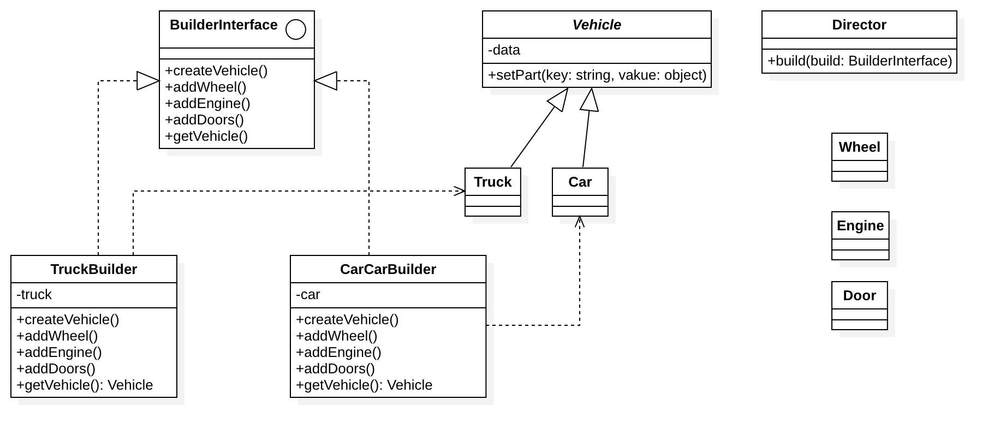

# 建造者模式

## 目的
建造者是创建一个复杂对象的一部分接口。

有时候，如果建造者对他所创建的东西拥有较好的知识储备，这个接口就可能成为一个有默认方法的抽象类（又称为适配器）。

如果对象有复杂的继承树，那么对于建造者来说，有一个复杂继承树也是符合逻辑的。

注意：建造者通常有一个「[流式接口(链式调用)](https://zh.wikipedia.org/wiki/%E6%B5%81%E5%BC%8F%E6%8E%A5%E5%8F%A3)」，例如 PHPUnit 模拟生成器。

## 举例
phpunit

## 解决的问题
- 方便用户创建复杂的对象（不需要知道实现过程）
- 代码复用性 & 封装性（将对象构建过程和细节进行封装 & 复用）

## 应用场景
- 需要生成的产品对象有复杂的内部结构，这些产品对象具备共性；
- 隔离复杂对象的创建和使用，并使得相同的创建过程可以创建不同的产品。

## UML类图

