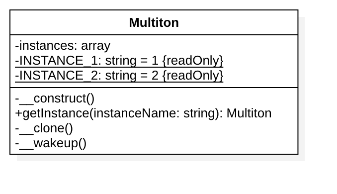

# 多例模式

# 备注
多例模式被公认为是 反面模式，为了获得更好的可测试性和可维护性，请使用『依赖注入模式』。

## 目的
多例模式是指存在一个类有多个相同实例，而且该实例都是该类本身。这个类叫做多例类。 多例模式的特点是：

多例类可以有多个实例。
多例类必须自己创建、管理自己的实例，并向外界提供自己的实例。
多例模式实际上就是单例模式的推广。

## 举例
- 2 个数据库连接器，比如一个是 MySQL ，另一个是 SQLite
- 多个记录器（一个用于记录调试消息，一个用于记录错误）

## UML类图

