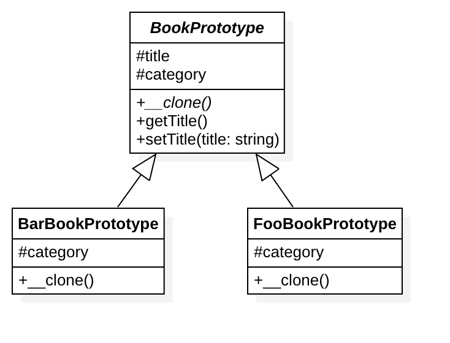

# 原型模式

## 目的
相比正常创建一个对象 (new Foo () )，首先创建一个原型，然后克隆它会更节省开销。

## 注意点
浅复制：被复制所有变量都含有与原来的对象相同的值，而所有的对其他对象的引用都仍指向原来的对象。
深复制：深复制把引用对象的变量指向复制过的新对象，而不是原有的被引用的对象。

## 示例
- 大数据量 (例如：通过 ORM 模型一次性往数据库插入 1,000,000 条数据) 。

## UML 类图

