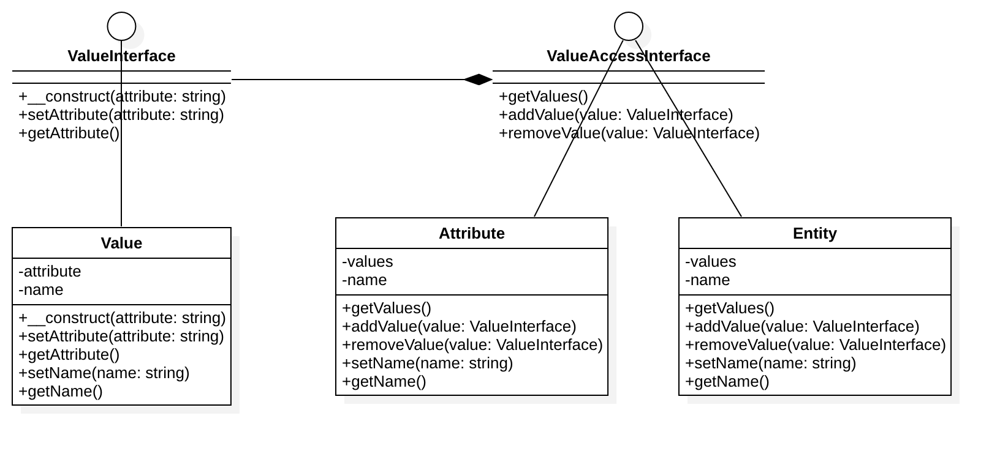

# 实体属性值模式（EAV 模式）（Entity--attribute--value）

## 目的
实体属性值模型（Entity-attribute-value EAV）是一种用数据模型描述实体的属性（属性，参数），可以用来形容他们潜在巨大，但实际上将适用于给定的实体的数量是相对较少。 
在数学中，这种模式被称为一个稀疏矩阵 。 
EAV 也被称为对象的属性值的模式，垂直的数据库模型和开放式架构。

## UML类图

