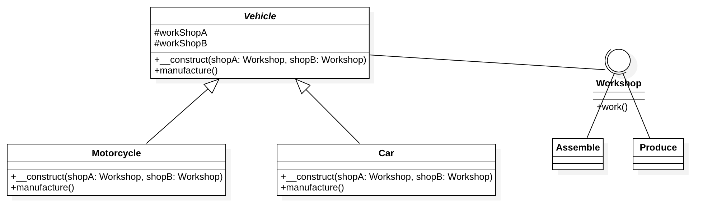

# 桥接模式

## 简述
将抽象部分与它的实现部分抽离，使它们都可以独立化的变化。

## 产生原因
桥梁模式完全是为了解决继承的缺点而提出的设计模式。
在该模式下，实现可以不受抽象的约束，不用再绑定在一个固定的抽象层次上。

## 总结
系统设计时，发现类的继承有 N 层时，可以考虑使用桥梁模式。
使用桥梁模式时主要考虑如何拆分抽象和实现，并不是一涉及继承就要考虑使用该模式。
桥梁模式的意图还是对变化的封装，尽量把可能变化的因素封装到最细、最小的逻辑单元中，避免风险扩散。

## UML类图

