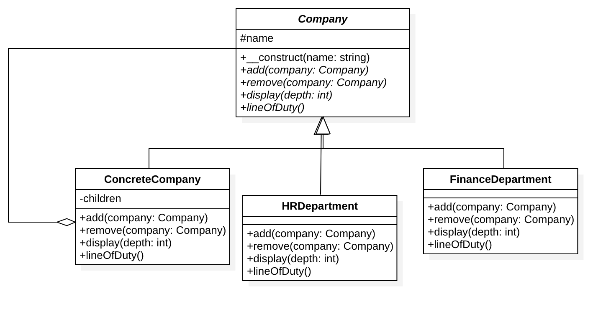

# 组合模式

## 设计动机
组合模式定义了如何将容器对象和叶子对象进行递归组合，使得客户在使用的过程中无须进行区分，可以对他们进行一致的处理。

## 定义
将对象组合成树状结构以表示「部分-整体」的层次结构。组合模式使得用户对单个对象和组合对象的使用具有一致性。

## 优缺点
### 优点
1. 可以清楚地定义分层次的复杂对象，表示对象的全部或部分层次，使得增加新构件也更容易。
2. 客户端调用简单，客户端可以一致的使用组合结构或其中单个对象。
3. 定义了包含叶子对象和容器对象的类层次结构，叶子对象可以被组合成更复杂的容器对象，而这个容器对象又可以被组合，这样不断递归下去，可以形成复杂的树形结构。
4. 更容易在组合体内加入对象构件，客户端不必因为加入了新的对象构件而更改原有代码。
### 缺点
1. 使设计变得更加抽象，对象的业务规则如果很复杂，则实现组合模式具有很大挑战性，而且不是所有的方法都与叶子对象子类都有关联

## UML类图

