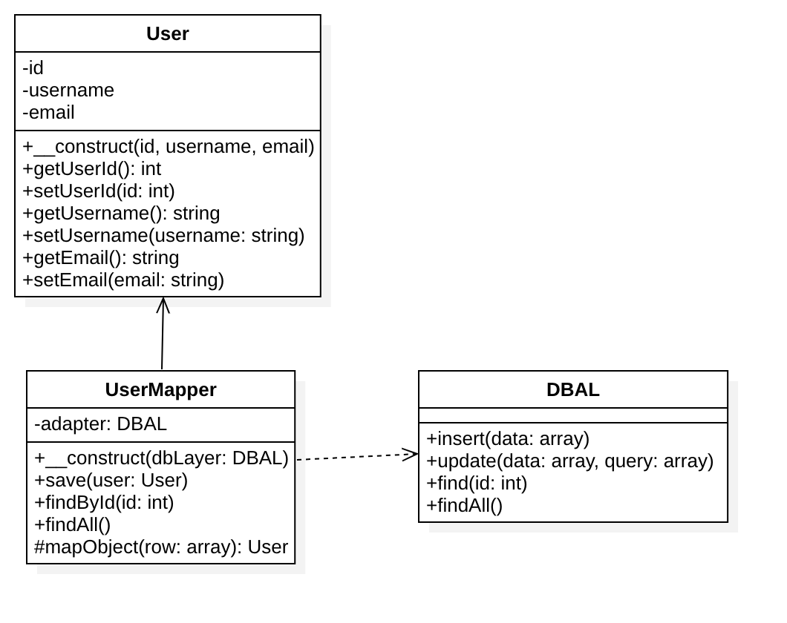

# 数据映射模式

## 定义
- 数据映射模式的目的是让持久化数据存储层、驻于内存的数据表现层、以及数据映射本身三者相互独立、互不依赖。
这个数据访问层由一个或多个映射器（或者数据访问对象）组成，用于实现数据传输。
通用的数据访问层可以处理不同的实体类型，而专用的则处理一个或几个。
- 数据映射模式的核心在于它的数据模型遵循单一职责原则（Single Responsibility Principle）, 这也是和 Active Record 模式的不同之处。
最典型的数据映射模式例子就是数据库 ORM 模型 （Object Relational Mapper）。
- 准确来说该模式是个架构模式。

## UML类图

