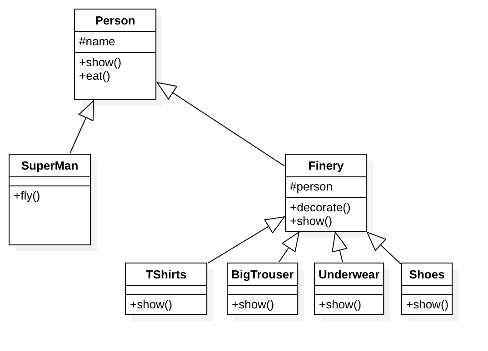

# 装饰模式

## 目的
动态的的给一个对象添加一些额外的职能，就增加功能来说，装饰模式比生成子类更加灵活。

为类实例动态增加新的方法。

## 用例
- Zend Framework: Zend_Form_Element 实例的装饰者
- eb Service Layer: 用于 REST 服务的 JSON 和 XML 装饰者 (当然，在这个例子中理应只有一个是被允许的)

## 优点
把类的装饰功能从类中搬移去除，简化原有的类。
将类的核心职责与类的功能区区分开来。去除相关类中重复的装饰逻辑。

## UML 类图

