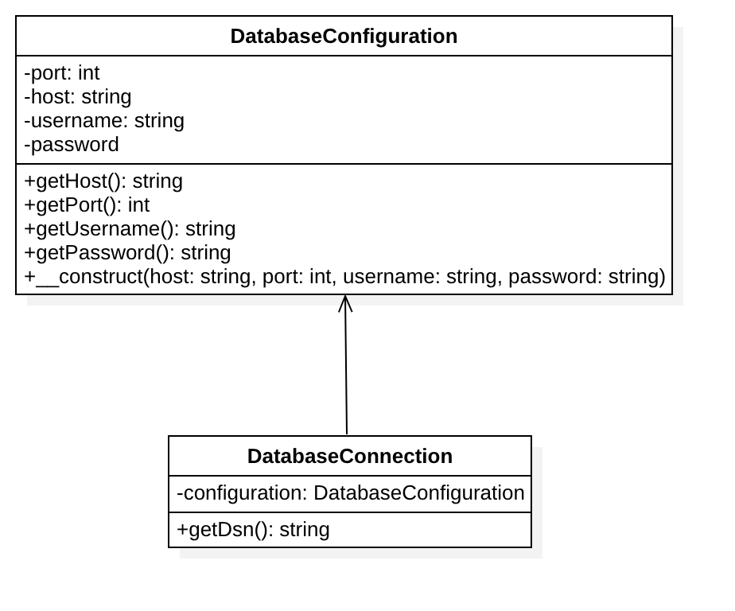

# 依赖注入模式

## 目的
用松散耦合的方式来更好的实现可测试、可维护和可扩展的代码。

## 用法
DatabaseConfiguration 被注入  DatabaseConnection  并获取所需的  $config 。
如果没有依赖注入模式， 配置将直接创建  DatabaseConnection 。这对测试和扩展来说很不好。

## 辅助理解
[小明和他的手机](https://www.zhihu.com/question/32108444)

## UML 类图

