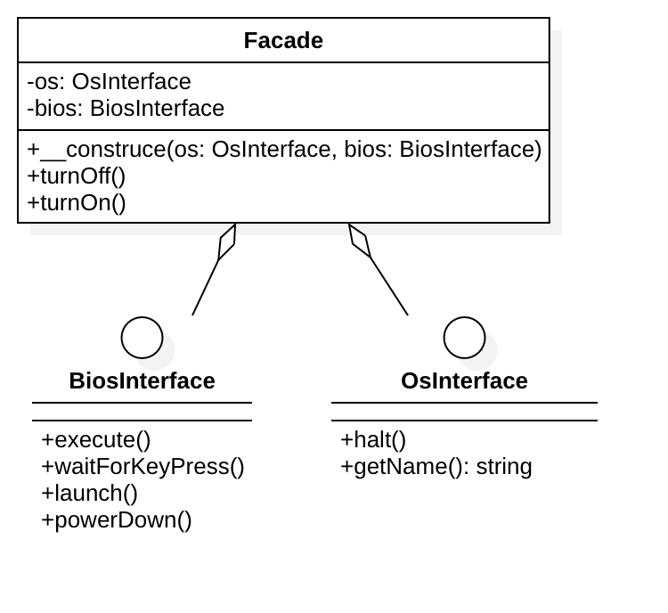

# 门面模式（外观模式）

## 概念
门面模式是对象的结构模式，外部与一个子系统的通信必须通过一个统一的门面对象进行。
门面模式提供一个高层次的接口，使得子系统更易于使用。

## 针对的问题
为子系统提供一个高层次的接口，使子系统易于使用。

## 角色组成
- 门面(Facade)角色：
- 子系统(subsystem)角色：

## 举例
现代的软件系统都是比较复杂的，设计师处理复杂系统的一个常见方法便是将其“分而治之”，把一个系统划分为几个较小的子系统。

医院的例子：如果把医院作为一个子系统，按照部门职能，这个系统可以划分为挂号、门诊、划价、化验、收费、取药等。看病的病人要与这些部门打交道，
就如同一个子系统的客户端与一个子系统的各个类打交道一样，不是一件容易的事情。

首先病人必须先挂号，然后门诊。如果医生要求化验，病人必须首先划价，然后缴费，才可以到化验部门做化验。化验后再回到门诊室。

解决这种不便引进门面模式，医院可以设置一个接待员的位置，由接待员负责代为挂号、划价、缴费、取药等。
这个接待员就是门面模式的体现，病人只接触接待员，由接待员与各个部门打交道。

## UML 类图

