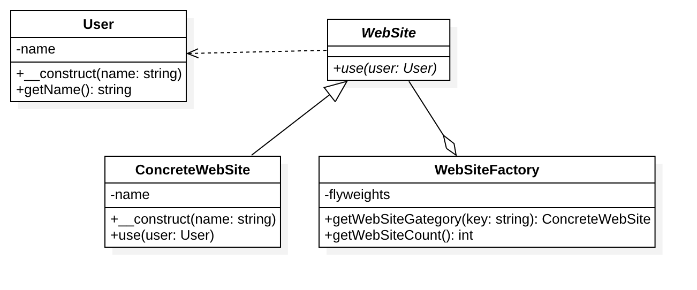

# 享元模式

## 来源
面向对象虽然很好地解决了抽象性的问题，但是对于一个实际运行的软件系统，我们还需要考虑面向对象的代价问题，
享元模式解决的就是面向对象的代价问题。享元模式采用对象共享的做法来降低系统中对象的个数，从而降低细粒度对象给系统带来的内存压力。

## 定义
为了节约内存的使用，享元模式会尽量使类似的对象共享内存。
在大量类似对象被使用的情况中这是十分必要的。
常用做法是在外部数据结构中保存类似对象的状态，并在需要时将他们传递给享元对象。

运用共享技术有效地支持大量细粒度对象的复用。系统只使用少量的对象，而这些对象都很相似，状态变化很小，可以实现对象的多次复用。
由于享元模式要求能够共享的对象必须是细粒度对象，因此它又称为轻量级模式，它是一种对象结构型模式。

## 优缺点
### 优点
1. 享元模式的优点在于它可以极大的减少内存中对象的数量，使得相同对象或相似对象在内存中只保存一份。
2. 享元模式的外部状态相对独立，而且不会影响其内部状态，从而使得享元对象可以在不同的环境中被共享。

### 缺点
1. 享元模式使得系统更加复杂，需要分离出内部状态和外部状态，这使得程序的逻辑复杂化。
2. 为了使对象可以共享，享元模式需要将享元对象的状态外部化，而读取外部状态使得运行时间变长。

## UML类图

