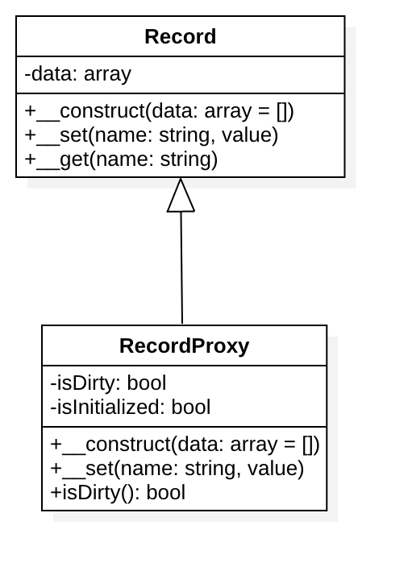

# 代理模式

## 目的
代理模式（Proxy）为其他对象提供一种代理以控制对这个对象的访问。使用代理模式创建代理对象，让代理对象控制目标对象的访问
（目标对象可以是远程的对象、创建开销大的对象或需要安全控制的对象），并且可以在不改变目标对象的情况下添加一些额外的功能。

在某些情况下，一个客户不想或者不能直接引用另一个对象，而代理对象可以在客户端和目标对象之间起到中介的作用，
并且可以通过代理对象去掉客户不能看到的内容和服务或者添加客户需要的额外服务。

经典例子就是网络代理，你想访问 Facebook 或者 Twitter ，如何绕过 GFW？找个代理网站。

## 定义
给目标对象提供一个代理对象，并由代理对象控制对目标对象的引用

## 主要作用
通过引入代理对象的方式来间接访问目标对象

## 解决的问题
给目标对象提供一个代理对象，并由代理对象控制对目标对象的引用

## 优缺点
### 优点
- 协调调用者和被调用者，降低了系统的耦合度
- 代理对象作为客户端和目标对象之间的中介，起到了保护目标对象的作用

### 缺点
- 由于在客户端和真实主题之间增加了代理对象，因此会造成请求的处理速度变慢；
- 实现代理模式需要额外的工作（有些代理模式的实现非常复杂），从而增加了系统实现的复杂度。

## UML 类图

